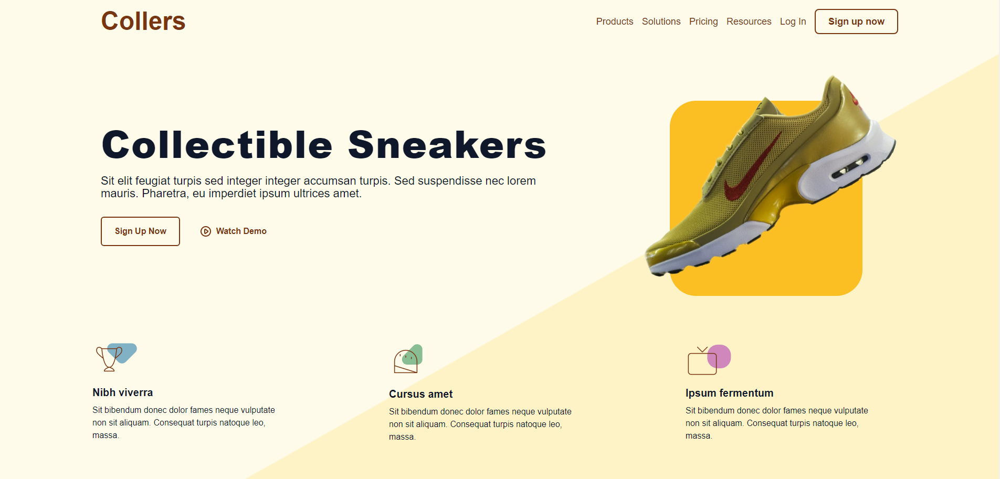
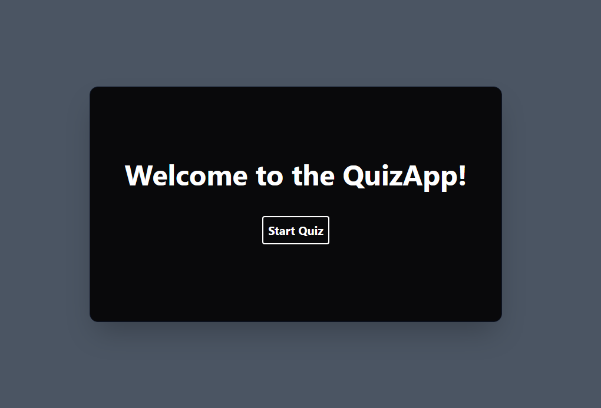

# Shoe & Quiz Apps Repository

This repository contains two different applications: a Static Shoe Website built with Vue.js and Tailwind CSS, and a Quiz Application built with React and Tailwind CSS.

## Static Shoe Website with Vue.js and Tailwind CSS

This application is a website showcasing various shoe models. It has been developed using Vue.js and Tailwind CSS, providing a responsive design.

- [README file for the Static Shoe Website](./case/README.md)

## Quiz Application with React and Tailwind CSS

This application allows users to solve a 10-question quiz test. Each question has 4 options. It is built with React and Tailwind CSS.

For more detailed information about each application, please refer to their respective README files.

- [README file for the Quiz Application](./quiz/README.md)

## License

This projects is licensed under the MIT License. See the [LICENSE](LICENSE) file for more information.