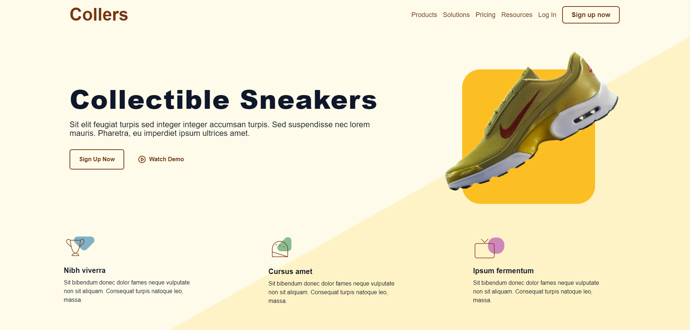

# Collers 



This application allows users to explore a static shoe website. The website showcases various shoe models and information. It has been developed using technologies such as Vue.js, Tailwind CSS, and Glide.js. Additionally, the application features a responsive design.

## How to Run?

1. Download or clone the application:

    ```
    git clone https://github.com/Rekl0w/Tasks.git
    ```

2. Navigate to the project directory:

    ```
    cd Tasks
    cd case
    ```

3. Install dependencies:

    ```
    npm install
    ```

4. Run the app.

    ```
    npm run dev
    ```

5. The Collers application will start.

## Technologies Used

- Vue
- Javascript
- Tailwind
- Vite
- Glide.js

## Screenshots

### Normal


### Responsive


## License

This project is licensed under the MIT License. See the [LICENSE](LICENSE) file for more information.
