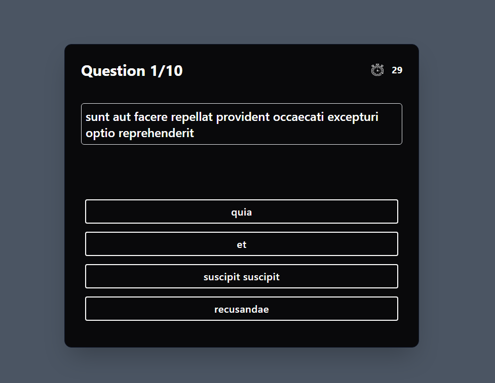
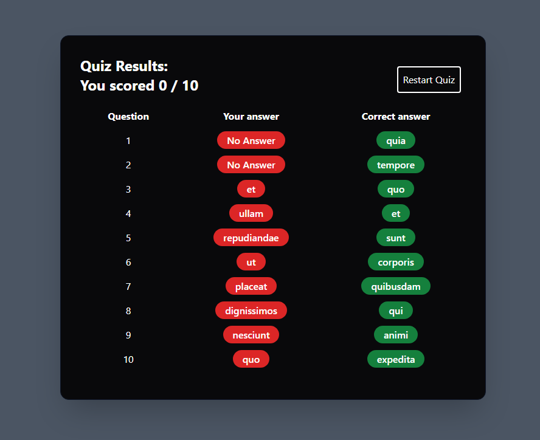

# Quiz App


This application allows users to solve a 10-question quiz test. Each question has 4 options. Users must answer each question within 30 seconds. For the first 10 seconds, options cannot be clicked and become clickable after 10 seconds. After 30 seconds, the application automatically moves to the next question, and users cannot go back to previous questions.

## How to Run?

1. Download or clone the application:

    ```
    git clone https://github.com/Rekl0w/Tasks.git
    ```

2. Navigate to the project directory:

    ```
    cd Tasks
    cd quiz
    ```

3. Install dependencies:

    ```
    npm install
    ```

4. Run the app.

    ```
    npm run dev
    ```

5. The quiz application will start, and users can start answering the questions.

## Technologies Used

- React
- Javascript
- Tailwind
- Vite

## Question and Option Data

Quiz questions and options are fetched from [jsonplaceholder.typicode.com](https://jsonplaceholder.typicode.com/posts).

## Screenshots





## License

This project is licensed under the MIT License. See the [LICENSE](LICENSE) file for more information.
